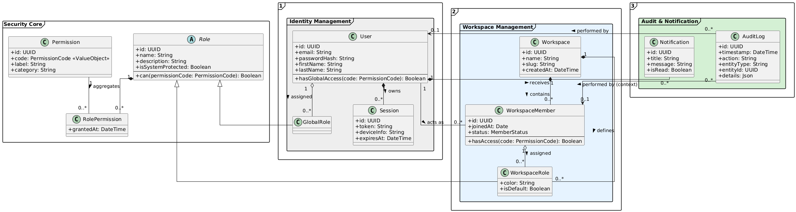
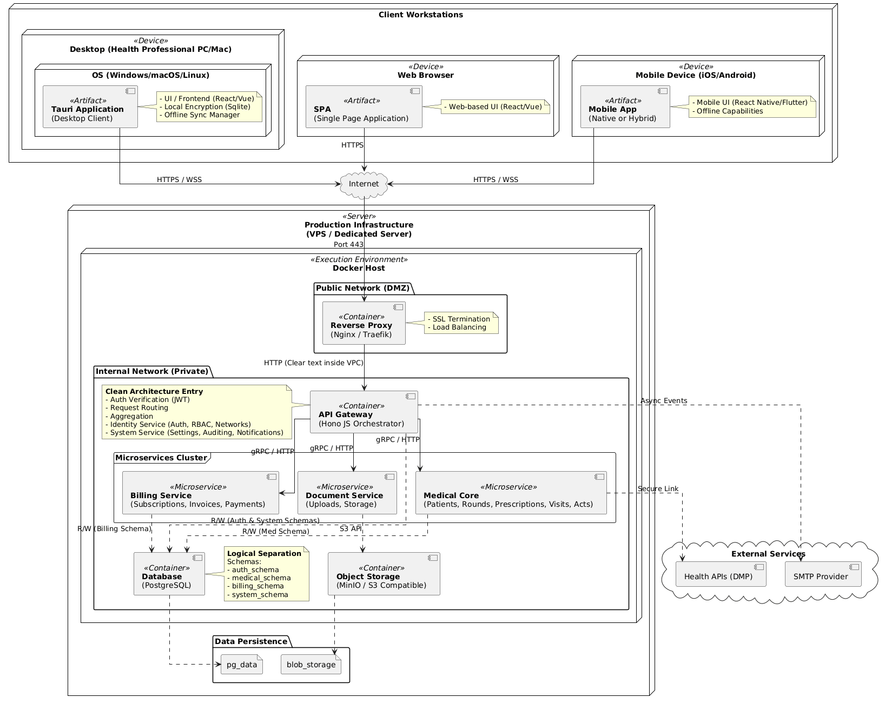
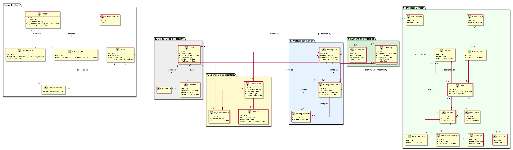
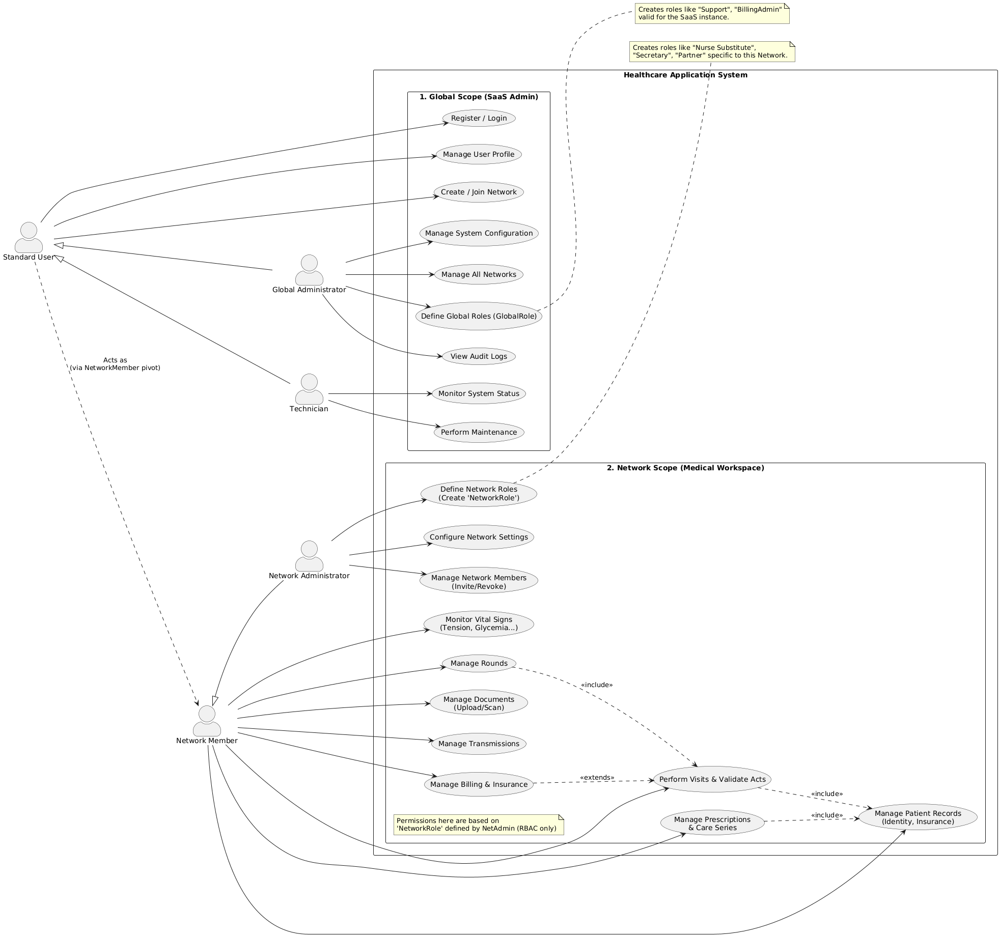

# Lellis

Lellis is a secure, high-performance backend platform designed for healthcare professionals.  
It focuses on the management of sensitive medical data, collaborative workspaces, and fine-grained access control, while strictly adhering to **Clean Architecture** and **Microservices** principles.

The project prioritizes **domain isolation**, **security**, and **scalability**, making it suitable for medical contexts with strong regulatory constraints.

---

## Project Overview

Lellis aims to provide healthcare professionals (such as nurses and medical practices) with a modern and modular platform to:

- centralize patient data,
- organize medical visits and rounds,
- collaborate securely within structured workspaces,
- enforce strict access control on sensitive medical information.

Rather than delivering a monolithic and rigid system, Lellis is designed to evolve progressively, with a strong emphasis on **domain clarity**, **explicit security boundaries**, and **incremental complexity**.

---

## Problem Statement

Healthcare professionals face multiple operational challenges:

- daily rounds with strict scheduling constraints,
- fragmented and poorly structured patient information,
- unorganized medical documents,
- collaboration between multiple practitioners and roles,
- heavy administrative workload,
- very high confidentiality and compliance requirements.

Existing tools are often either too complex, too rigid, or insufficiently adapted to real-world medical workflows.

Lellis addresses these challenges by providing:

- a centralized and structured data model,
- collaborative workspaces (networks),
- a robust and explicit authorization model,
- multi-platform access (desktop-first),
- a modern, secure, and modular backend architecture.

---

## Core Concepts

### Users and Workspaces

- A **User** represents an individual account at the platform level.
- A **Workspace** represents a collaborative environment (e.g. a medical practice or healthcare team).
- A user participates in a workspace through a **Workspace Member** context, which defines their local responsibilities and permissions.

This separation allows the same user to belong to multiple workspaces with different roles and access levels.

---

## Security Architecture – Progressive Implementation

Security is a **first-class concern** in Lellis due to the sensitive medical nature of the data.  
However, implementing a fully expressive authorization system from day one would introduce unnecessary complexity and slow down delivery.

For this reason, the **Security Core is developed in two distinct phases**.

---

## Phase 1 – Foundational Security Core (Deliverable)

The first phase focuses on a **robust, understandable, and production-ready security foundation**.

Its objectives are:

- ensure strong isolation between users and workspaces,
- provide clear role-based access control (RBAC),
- support real-world collaboration scenarios,
- remain simple enough to be reliably implemented and audited.

### Key Characteristics

- Role-Based Access Control (RBAC)
- Explicit permissions expressed as domain value objects
- Separation between global roles and workspace roles
- Deterministic permission evaluation
- Centralized audit logging
- No contextual or attribute-based rules yet

This phase deliberately avoids advanced policy engines or dynamic rules in order to guarantee **correctness, maintainability, and fast iteration**.

---

## Phase 1 – Security Core Class Diagram

The following diagram represents the **Phase 1 Security Core domain model**, which is currently implemented and considered the stable foundation of the system.

### Design Overview

#### Security Core (RBAC)

- `Role` is an abstract domain concept.
- Roles aggregate permissions through `RolePermission`.
- Permissions are expressed using explicit `PermissionCode` value objects.
- Roles can evaluate permissions deterministically via `can(permissionCode)`.

#### Identity Management

- Users are assigned **global roles**.
- Sessions represent authenticated contexts.
- Global permissions apply outside of any workspace context.

#### Workspace Management

- Workspaces define collaborative boundaries.
- Users interact with workspaces through `WorkspaceMember`.
- Workspace-specific roles allow fine-grained delegation without affecting global privileges.

#### Audit & Notification

- All sensitive actions are auditable.
- Audit logs preserve actor identity and optional workspace context.
- Notifications provide feedback without exposing sensitive data.

---

## Phase 2 – Advanced Authorization (Planned)

The second phase will extend the Security Core with **context-aware authorization** mechanisms.

This phase is intentionally postponed to avoid premature complexity.

Planned extensions include:

- Attribute-Based Access Control (ABAC)
- Contextual permissions (time, assignment, emergency access)
- Medical-specific access rules (e.g. assigned caregiver)
- Policy composition and evaluation strategies
- Temporary and delegated permissions

Phase 2 will be designed **on top of** the Phase 1 foundation, without breaking existing domain contracts.

---

## Architecture Overview

Lellis follows **Clean Architecture** principles with strict separation between:

- domain logic,
- application services,
- infrastructure and delivery mechanisms.

### High-Level Deployment Architecture

Key characteristics:

- desktop client built with **Tauri**,
- API access through a centralized gateway,
- backend services evolving toward microservices,
- strict isolation between domain and infrastructure concerns.

---

## Domain Model Overview

The medical domain is modeled independently from security and infrastructure.

Core domain concepts include:

- patients and medical records,
- visits, rounds, and care activities,
- documents and medical artifacts,
- collaborative structures.

---

## Use Case Overview

The system distinguishes between **global operations** and **workspace-level medical workflows**.

### Global Scope

- authentication and identity management,
- platform administration,
- workspace lifecycle management,
- security supervision and auditing.

### Workspace Scope

- patient record access,
- visit and round planning,
- document management,
- internal collaboration.

---

## Technology Stack

### Backend

- TypeScript
- Bun
- HonoJS / ElysiaJS
- PostgreSQL
- Prisma
- Docker

### Clients

- Desktop (Tauri)
- Web (planned)
- Mobile (planned)

---

## Project Status and Roadmap

### Phase 1 – MVP

- identity and workspace management,
- foundational Security Core (RBAC),
- stable backend API,
- desktop client,
- basic patient records,
- basic planning features.

Phase 2 will progressively introduce advanced authorization, medical workflows, and integrations.

---

## License

This project is under active development.  
License information will be defined at a later stage.
