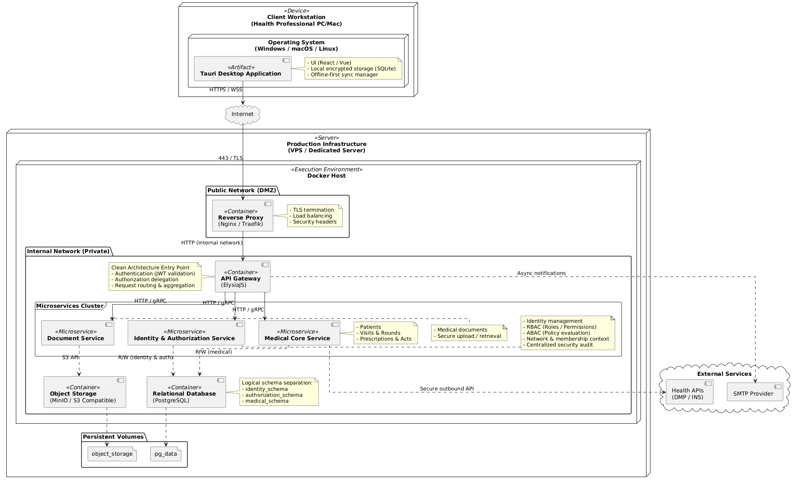
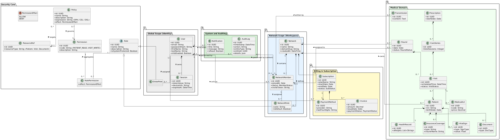

# Lellis
Lellis is a secure, high-performance backend platform designed for healthcare professionals.
It focuses on the management of sensitive medical data, collaborative workspaces, and fine-grained access control, while strictly adhering to **Clean Architecture** and **Microservices** principles.
The project prioritizes **domain isolation**, **security**, and **scalability**, making it suitable for medical contexts with strong regulatory constraints.
---
## Project Overview
Lellis aims to provide healthcare professionals (such as nurses and medical practices) with a modern and modular platform to:
- centralize patient data,
- organize medical visits and rounds,
- collaborate securely within structured workspaces,
- enforce strict access control on sensitive medical information.
Unlike existing solutions that are often rigid or overloaded, Lellis focuses on a **clear domain model**, **progressive feature development**, and a **robust authorization system** adapted to real-world medical workflows.
---
## Problem Statement
Healthcare professionals face multiple operational challenges:
- daily rounds with tight scheduling constraints,
- fragmented patient information,
- unstructured medical documents,
- collaboration across multiple practitioners,
- heavy administrative workload,
- strict confidentiality and data protection requirements.
Many existing tools are either too complex, insufficiently flexible, or poorly adapted to field work.
Lellis addresses these issues by providing:
- centralized and structured medical data,
- collaborative workspaces (networks),
- fine-grained authorization and auditability,
- multi-platform support (desktop-first),
- a modern, secure, and modular backend architecture.
---
## Core Concepts
### Users and Networks
- A **User** represents an individual account at the platform level.
- A **Network** represents a collaborative workspace (e.g. a medical practice or team).
- A user participates in a network through a **Network Member** context, which defines their local responsibilities and permissions.
### Authorization Model
Lellis uses a **RBAC (Role-Based Access Control)** model to define structural permissions.
This approach allows expressing rules such as:
- access to a patient record only if assigned to the visit,
- temporary permissions during emergencies,
- restrictions based on network membership, time, or context.
---
## Architecture Overview
The platform is designed following **Clean Architecture** principles, with strict separation between domain logic, application services, and infrastructure concerns.
### High-Level Deployment Architecture

Key characteristics:
- desktop client built with **Tauri**,
- web SPA and mobile app clients,
- secure API access through an API Gateway (Hono JS, including identity and system services),
- microservices-oriented backend (Medical Core, Document Service, Billing Service),
- strict separation of medical data and infrastructure services.
---
## Domain Model
The domain model is centered around medical workflows while remaining independent of infrastructure and security concerns.

Key domain entities include:
- patients and health records,
- visits, rounds, and care series,
- medical acts and documents,
- collaborative network structures.
---
## Use Cases Overview
The platform distinguishes between **global (instance-level)** responsibilities and **network-level** medical operations.

### Global Scope
- user registration and authentication,
- global administration and configuration,
- network creation and management,
- system monitoring and audit access.
### Network Scope
- patient record management,
- visit and round planning,
- prescription and care tracking,
- secure document handling,
- internal communication between members.
---
## Technology Stack
### Backend
- TypeScript
- Bun
- Hono JS
- PostgreSQL
- Prisma
- Docker
### Client
- Tauri (Desktop)
- SPA (Web)
- Mobile app
### Infrastructure
- Dockerized services
- Reverse proxy (Nginx / Traefik)
- Object storage (S3-compatible)
- Progressive evolution toward orchestration (Docker Compose → Kubernetes)
---
## Security Considerations
Security is a first-class concern due to the medical nature of the data:
- strict separation of domain and infrastructure layers,
- centralized authentication and authorization,
- RBAC access control,
- encrypted local storage on clients,
- comprehensive audit logging of sensitive operations.
---
## Project Status and Roadmap
### Phase 1 – MVP
- user and network management,
- authorization model (RBAC foundations),
- stable backend API,
- desktop client,
- basic patient records,
- basic planning and visits.
Future phases will progressively introduce:
- advanced medical workflows,
- billing and insurance support,
- external medical service integrations,
- analytics and dashboards,
- AI-assisted features.
---
## License
This project is currently under active development.
License details will be defined at a later stage.